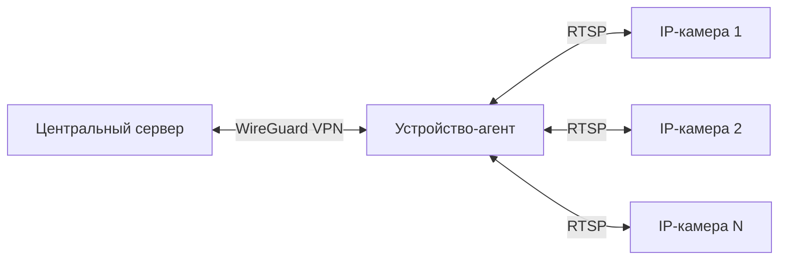

# Video Central System

Система управления IP-камерами через VPN-агент

## Архитектура системы

## Особенности
- Централизованное управление удалёнными камерами
- Безопасное соединение через VPN
- Поддержка нескольких камер на одном устройстве
- Запись видео по команде с сервера
- Автоматическая загрузка записей

## Технологии
- PHP 8.0+
- WireGuard VPN
- FFmpeg для работы с видео
- Symfony HTTP Foundation (для сервера)
- Systemd для управления сервисами

## Требования
- Сервер: Ubuntu 22.04, PHP 8.1, Composer
- Агент: Ubuntu 22.04, PHP 8.1, FFmpeg

## Документация
- [Руководство по установке](docs/setup_guide.md)
- [Архитектура системы](docs/architecture.md)
- [Тестовые процедуры](docs/test_procedures.md)
