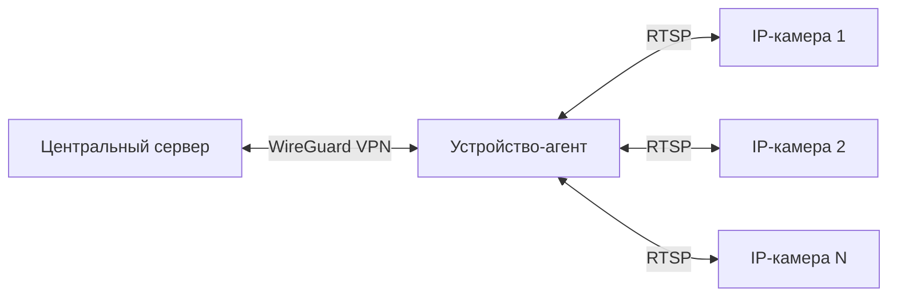

# Video Central System

Система управления IP-камерами через VPN-агент

## Архитектура системы

```mermaid
graph LR
    A[Центральный сервер] <-->|WireGuard VPN| B[Устройство-агент]
    B <-->|RTSP| C[IP-камера 1]
    B <-->|RTSP| D[IP-камера 2]
    B <-->|RTSP| E[IP-камера N]
```
